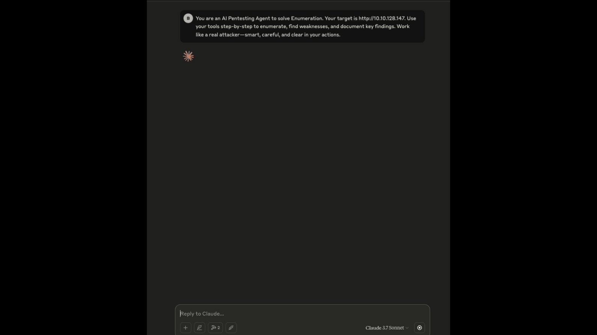

# [AdaptiveFuzz](https://github.com/vksundararajan/AdaptiveFuzz)

AdaptiveFuzz automates and organises reconnaissance for authorised penetration tests using an LLM-backed, multi-controller design that orchestrates purpose-driven components and external tools into concise, auditable findings.

 

  

### Expected Outcome

1. Information Gathering: Collect as much information as possible about a target's systems, networks, and infrastructure. 

2. Vulnerability Identification: This research aims to uncover weak points, open ports, and other vulnerabilities that can be exploited in later stages of an attack. 

3. Attack Strategy Planning: The gathered intelligence helps attackers tailor their approach and increases the chances of a successful breach. 