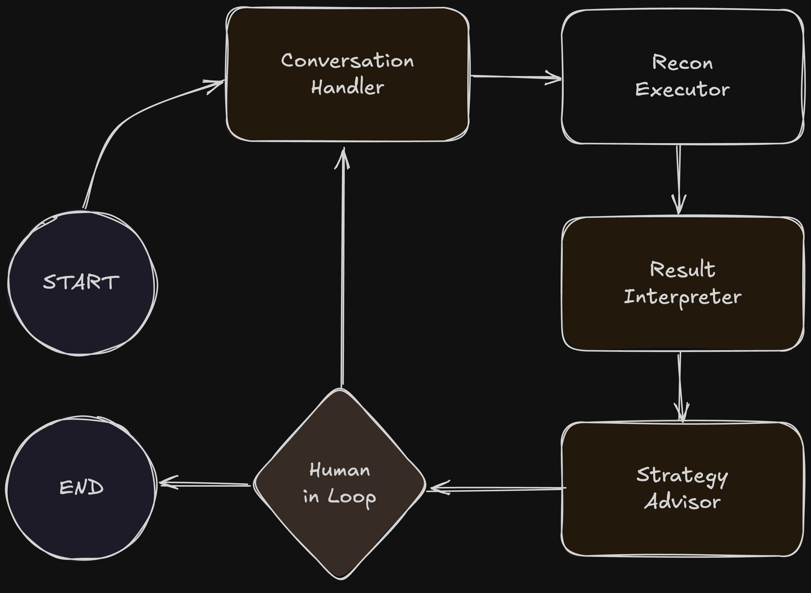

# [AdaptiveFuzz](https://github.com/vksundararajan/AdaptiveFuzz)

AdaptiveFuzz streamlines and manages reconnaissance for authorised penetration testing by using an LLM-based, multi-controller approach. This system coordinates targeted modules and external tools and produces clear, auditable reports that help document the findings.

## Expected Outcome

1. Information Gathering: Collect as much information as possible about a target's systems, networks, and infrastructure. 

2. Vulnerability Identification: This research aims to uncover weak points, open ports, and other vulnerabilities that can be exploited in later stages of an attack. 

3. Attack Strategy Planning: The gathered intelligence helps attackers tailor their approach and increases the chances of a successful breach.

## Architecture

  

## MCP Tools

AdaptiveFuzz utilises 8 specialised MCP tools that orchestrate intelligent penetration testing workflows. Each tool is designed for a specific phase of the security assessment lifecycle.

- `make_http_request` Send customised HTTP requests with complete control over methods, headers, and payloads. Useful for testing API endpoints and web service vulnerabilities.

- `check_security_headers` Analyse security headers to identify missing protections and information disclosure risks in HTTP responses.

- `search_exploitdb` Search the Exploit Database for known exploits matching discovered software versions or CVE identifiers. Supports advanced filtering and precise version matching.

- `detect_technologies` Perform automated technology stack fingerprinting using webtech. Identifies frameworks, libraries, and platforms with confidence scoring.

- `lookup_cve` Retrieve detailed vulnerability intelligence from the National Vulnerability Database, including CVSS metrics, impact assessments, and remediation references.

- `secure_executor` Run penetration testing commands in a sandboxed environment with blacklist validation, timeout controls, and comprehensive logging.

- `get_executor_history` View complete audit trails of executed commands, including outputs, return codes, and security validation results.

- `get_allowed_commands` Access the curated whitelist of approved system utilities and pentesting tools available for execution.
