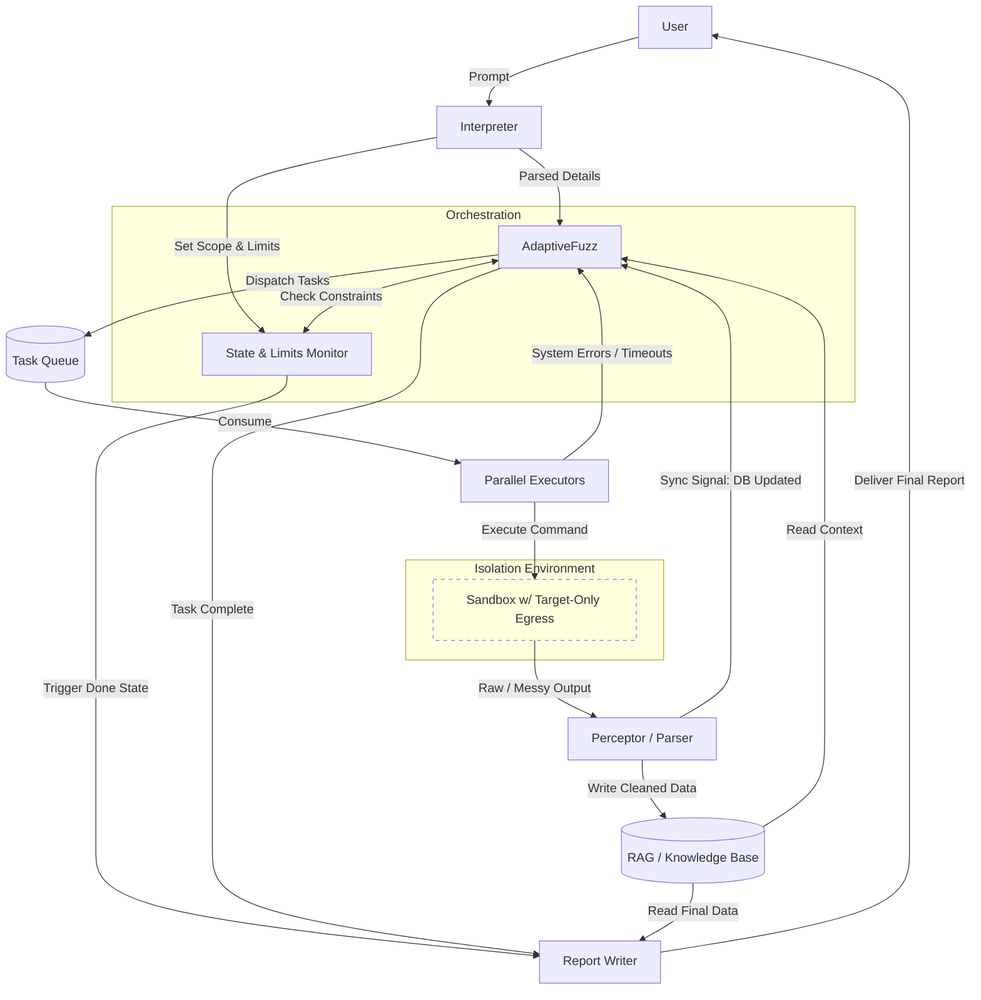

# AdaptiveFuzz

AdaptiveFuzz is an intelligent, agentic framework that leverages Large Language Models (LLMs) to dynamically analyze, execute, and report on systems and software.

## Architecture

```mermaid
%%{init: {'flowchart': {'curve': 'basis'}} }%%
flowchart TB
    user[User]
    interpreter[Interpreter]
    
    subgraph Orchestration
        AdaptiveFuzz[AdaptiveFuzz]
        StateMonitor[State & Limits Monitor]
    end
    
    TaskQueue[(Task Queue)]
    executor[Parallel Executors]
    
    subgraph Isolation Environment
        sandbox[Sandbox w/ Target-Only Egress]
    end
    
    perceptor[Perceptor / Parser]
    rag[(RAG / Knowledge Base)]
    report_writer[Report Writer]

    user --> |Prompt| interpreter
    interpreter --> |Set Scope & Limits| StateMonitor
    interpreter --> |Parsed Details| AdaptiveFuzz

    AdaptiveFuzz <--> |Check Constraints| StateMonitor
    AdaptiveFuzz --> |Dispatch Tasks| TaskQueue
    TaskQueue --> |Consume| executor

    executor --> |Execute Command| sandbox
    executor --> |System Errors / Timeouts| AdaptiveFuzz
    
    sandbox --> |Raw / Messy Output| perceptor
    perceptor --> |Write Cleaned Data| rag
    perceptor --> |Sync Signal: DB Updated| AdaptiveFuzz

    rag --> |Read Context| AdaptiveFuzz
    
    StateMonitor --> |Trigger Done State| report_writer
    AdaptiveFuzz --> |Task Complete| report_writer
    rag --> |Read Final Data| report_writer
    report_writer --> |Deliver Final Report| user

    style sandbox stroke-dasharray: 5 5,fill:transparent
```
