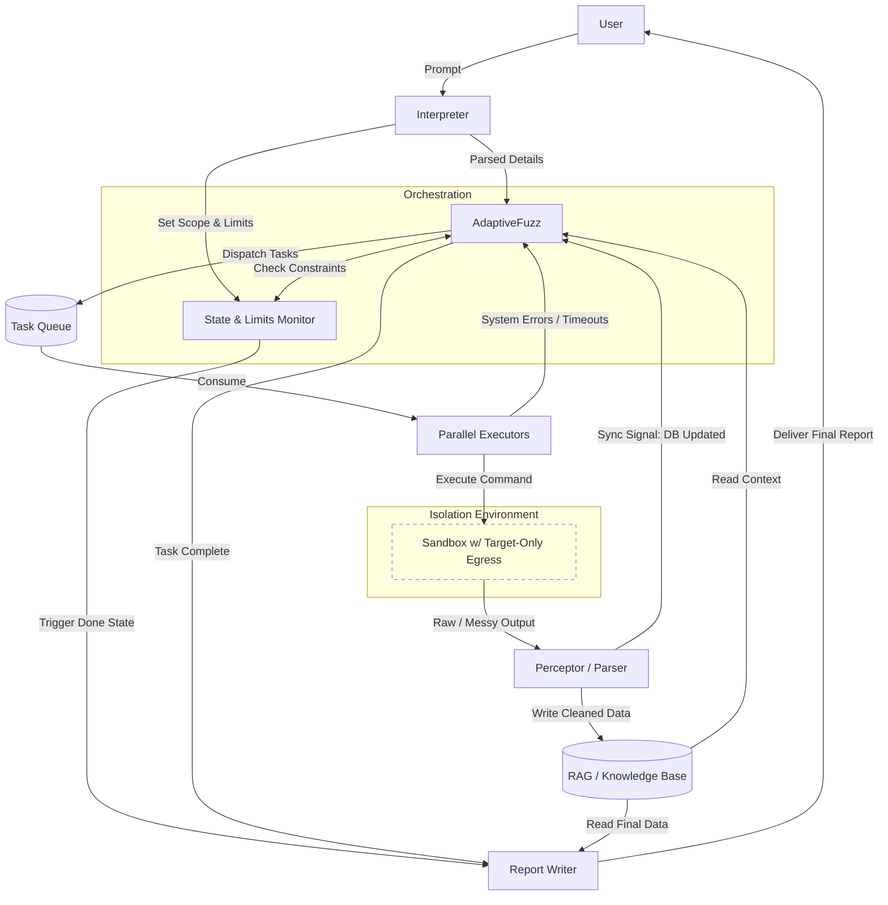

# AdaptiveFuzz

AdaptiveFuzz is an intelligent, agentic framework that leverages Large Language Models (LLMs) to dynamically analyze, execute, and report on systems and software.

## Architecture

```mermaid
%%{init: {'flowchart': {'curve': 'basis'}} }%%
flowchart TB
    user[User]
    interpreter[Interpreter]
    
    subgraph Orchestration
        AdaptiveFuzz[AdaptiveFuzz]
        StateMonitor[State & Limits Monitor]
    end
    
    TaskQueue[(Task Queue)]
    executor[Parallel Executors]
    
    subgraph Isolation Environment
        sandbox[Sandbox w/ Target-Only Egress]
    end
    
    perceptor[Perceptor / Parser]
    rag[(RAG / Knowledge Base)]
    report_writer[Report Writer]

    user --> |Prompt| interpreter
    interpreter --> |Set Scope & Limits| StateMonitor
    interpreter --> |Parsed Details| AdaptiveFuzz

    AdaptiveFuzz <--> |Check Constraints| StateMonitor
    AdaptiveFuzz --> |Dispatch Tasks| TaskQueue
    TaskQueue --> |Consume| executor

    executor --> |Execute Command| sandbox
    executor --> |System Errors / Timeouts| AdaptiveFuzz
    
    sandbox --> |Raw / Messy Output| perceptor
    perceptor --> |Write Cleaned Data| rag
    perceptor --> |Sync Signal: DB Updated| AdaptiveFuzz

    rag --> |Read Context| AdaptiveFuzz
    
    StateMonitor --> |Trigger Done State| report_writer
    AdaptiveFuzz --> |Task Complete| report_writer
    rag --> |Read Final Data| report_writer
    report_writer --> |Deliver Final Report| user

    style sandbox stroke-dasharray: 5 5,fill:transparent
```

## Todo List

- [ ] Write Python code for the Sandbox that creates a Docker container, runs a terminal command, captures the output, and deletes the container
- [ ] Initialize Huey with SQLite in project to set up local database-backed task queue
- [ ] Create a Huey task that takes a command string and runs it inside Sandbox code
- [ ] Write code for the Executor to trigger multiple Huey tasks asynchronously so they run in parallel
- [ ] Initialize a local, persistent ChromaDB database on machine to act as knowledge base
- [ ] Write Python helper functions for RAG Tools to save parsed text findings into ChromaDB and query them later
- [ ] Write an LLM prompt for the Perceptor that takes messy terminal output from the Sandbox and extracts structured key-value findings
- [ ] Write a Storage Script that takes the Perceptor's structured findings and saves them into ChromaDB using RAG Tools
- [ ] Write a counter for the State Monitor to track loop cycles and stop the program if it hits limit (e.g., max 5 runs)
- [ ] Add a check in the State Monitor to block any commands targeting IP addresses or domains outside allowed scope
- [ ] Build the AdaptiveFuzz agent using smolagents to query ChromaDB for current results, plan the next scan steps, and dispatch them to the Huey 
- [ ] Write an agent prompt for the Report Writer that pulls all text and metadata from ChromaDB and organizes it into a markdown report
- [ ] Create the main script to accept target domain, manage the loop cycles, run the Huey background worker, and print the final report