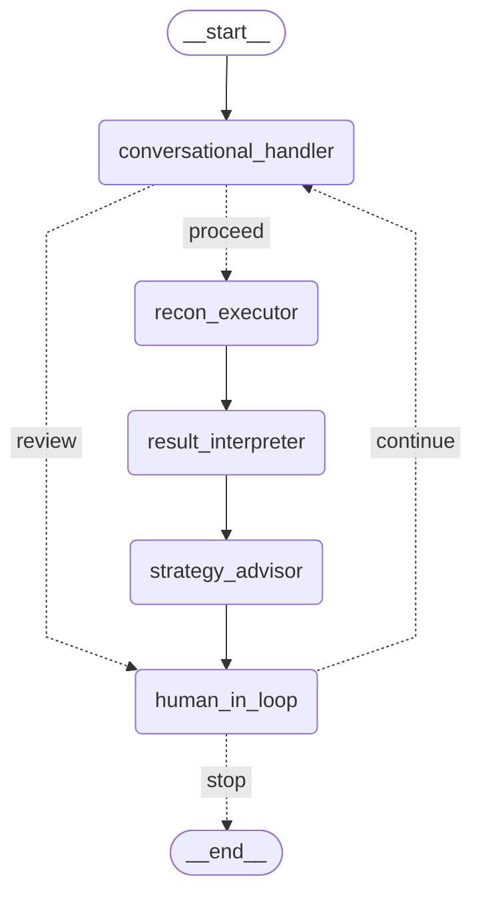

# [AdaptiveFuzz](https://github.com/vksundararajan/AdaptiveFuzz)

[](https://github.com/vksundararajan/AdaptiveFuzz/issues)


AdaptiveFuzz streamlines and manages reconnaissance for authorised penetration testing by using an LLM-based, multi-controller approach. This system coordinates targeted modules and external tools and produces clear, auditable reports that help document the findings.

## Expected Outcome

1. Information Gathering: Collect as much information as possible about a target's systems, networks, and infrastructure. 

2. Vulnerability Identification: This research aims to uncover weak points, open ports, and other vulnerabilities that can be exploited in later stages of an attack. 

3. Attack Strategy Planning: The gathered intelligence helps attackers tailor their approach and increases the chances of a successful breach.


## Architecture




## Installation

1. **Clone the repository:**
   ```bash
   git clone https://github.com/vksundararajan/AdaptiveFuzz.git
   cd AdaptiveFuzz
   ```

2. **Create and activate a virtual environment:**
   ```bash
   python3 -m venv .venv
   source .venv/bin/activate
   ```

3. **Install dependencies:**
   ```bash
   pip install -r requirements.txt
   ```

4. **Run the application:**
   ```bash
   python3 code/to_start.py
   ```


## MCP Tools

AdaptiveFuzz is powered by 8 security-focused MCP tools that help pentesters sort out their own security assessment.

- secure_executor
- get_executor_history
- get_allowed_commands
- make_http_request
- check_security_headers
- search_exploitdb 
- detect_technologies
- lookup_cve